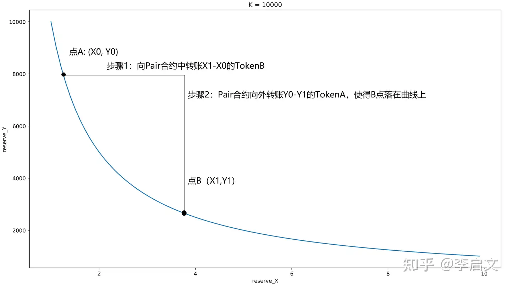
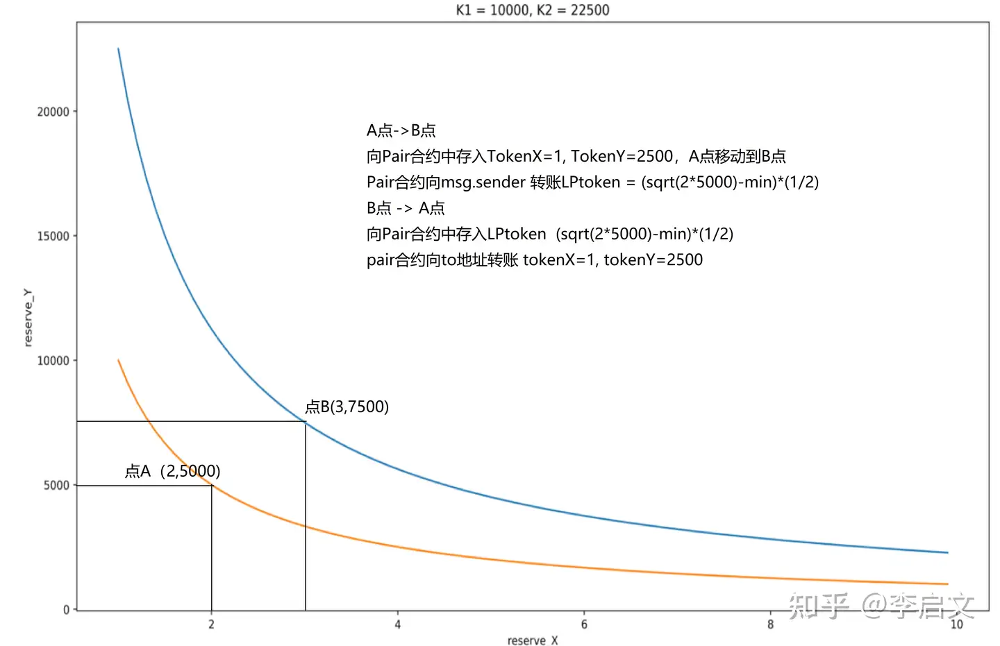
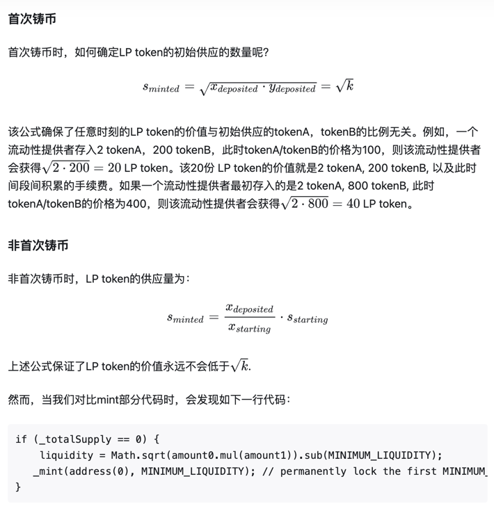

# blockchain
blockchain literacy

## 术语名词剖析
* 区块链
  
  区块链是一种分布式数据库技术，用于记录数字信息的交易和事件。它是一种去中心化的、公开的、安全的和可追溯的数据库，没有单一的控制中心，每个节点都有拷贝，并可以进行验证和更新。
  区块链可以用于存储数据、验证身份、执行智能合约和管理数字资产等应用场景。

* 智能合约
  
  智能合约是一种自动执行的计算机程序，它通过区块链技术实现。智能合约可以在没有中介或第三方的情况下执行交易，从而实现去中心化的交易。智能合约可以执行各种任务，例如验证和执行合同、管理数字资产和执行金融交易。
  智能合约是一种基于代码的协议，其中规定了各方在交易过程中必须满足的条件和规则，一旦满足条件，智能合约将自动执行交易。

* 共识机制
  * 定义：共识机制是指分布式系统中，为了保证数据的一致性和可信度而采用的一种机制。在分布式系统中，由于不存在中心化机构或中介，不同节点之间可能存在不同的数据状态或交易记录，因此需要采用共识机制来达成一致。
    共识机制可以通过节点之间的协作和竞争来保证数据的一致性和可信度。
  * 作用：确保数据一致性、防止双花攻击、防止恶意节点攻击、控制区块生成速度、避免中心化机构；
  * 优势：去中心化、安全性、公平性、可扩展性、智能合约、去信任化；
  * 缺点：能源消耗(PoW消耗算力大)、资源浪费(PoW)、可扩展性、中心化问题、安全性问题(PoS);
  * 实现方式：PoW(工作量证明)、PoS(权益证明)、PoS+Randomess(权益证明+随机数)、PoS+Staking(权益证明+权益抵押)、DPoS(委托权益证明)

* 分布式账本
  
  分布式账本是一种基于区块链技术的数据库，它分散存储在多个节点上，每个节点都有一份完整的账本副本。所有的节点通过共识机制达成一致，确保账本的完整性和安全性。
  分布式账本可以记录和存储各种类型的数据，包括交易记录、身份信息、物品的所有权等等。

* DEX

  去中心化数字货币交易所 - Decentralized Exchange
  * 优点：去中心化、自己掌握资产、选择范围广(更多山寨币可选)
  * 缺点：手续费高、无法兑换成法币、安全性(自己管理资产，容易被黑客攻击，不好找回)、用户体验
  * 主要交易所：dYdX、Uniswap、PancakeSwap、Curve、DODO
  
* CEX

  中心化数字货币交易所 - Centralized Exchange
  * 优点：充足的流动性、便利的使用者界面、其他高级功能；
  * 缺点：繁杂的KYC(Know Your Customer)规则、安全风险、撮合引擎不够透明、监管风险
  * 现货交易量排名：币安(Binance)、Coinbase、Kraken、Kucoin、OKX
  * 合约交易量排名：币安(Binance)、Bybit、OKX、Kucoin、Bitget
  
* DEFI

  去中心化金融 - decentralized finance，DeFi
  
* Dapp

  去中心化应用

* NFTs

  非同质化代币：NFTs 已经作为数字所有权和收藏品领域的一个创新分类而出现。NFT dApps 使得创建、购买和交易独一无二、不可分割的数字资产成为可能，这代表了对特定物品或内容的所有权，从而彻底改变了艺术、音乐和游戏产业。

## Uniswap
* uniswap

是以太坊上的一个dapp应用，后续的Defi繁荣，各样的swap，鼻祖就是uniswap。

* AMM（Automated Market Makers）

自动做市商，模型源于Vitalik于2017年发表的[博客]()，讨论了“恒定乘积公式”，即每一个Uniswap Pair 中存有两种资产，并为这两种资产提供流动性。

* swap函数

可以看到，如下图要从A点移动到B点,通过调用Uniswap的swap函数，需要先转账给pair合约一定数量X1-X0)的tokenB，然后pair合约将对应数量的tokenA转账出去到目标地址。
则转出去的tokenA的数量为(Y0-Y1), 在忽略手续费的情况下，此时的B点应该要落在曲线上。

* Mint函数：铸币函数

Burn函数：Mint函数的逆向，先向Pair合约中，转账一定量的LP token，然后通过Pair合约向外转账tokenA, tokenB. 使得上图中的B点回落到A点。

* 数值精度

由于solidity中并不原生支持小数，Uniswap采用UQ112.112这种编码方式来存储价格信息。UQ112.112意味着该数值采取224位来编码值，前112位存放小数点前的值，其范围是[0, 2^112-1]
,后112位存放小数点后的值，其精度可以达到1/^112.
  
  * Uniswap选择UQ112.112的原因：因为UQ112.112可以被存储位uint224，这会留下32位的空闲Storage插槽位。
  再一个是每个Pair合约的reserve0和reserve1都是Uint112，同样会留下32位的空闲插槽位。特别的是pair合约的reserve连同最近一个区块的时间戳一起存储时，该时间戳会对2^32
  取余数称为uint32格式的数值。加之，尽管在任意给定时刻的价格都是UQ112.112格式，保证为uint224位，一段时间累积的价格并不是该格式。
  在储存插槽中末端的额外的32位可以用来储存累积的价格的溢出部分。这种设计意味着在每一个区块的第一笔交易中只需要额外的三次SSTORE操作（目前的开销是15000gas）。 
  * 选择UQ112.112的缺点：最末端的32位用来储存时间戳会溢出，事实上一个Uint32的时间戳溢出点是02/07/2016.

* 闪电兑

Uniswap V2添加了闪电兑功能，允许用户在付钱之前接受和使用Token资产，只要他们在同一笔原子交易中。
闪电兑换功能在swap函数中实现：IUniswapV2Callee(to).uniswapV2Call(msg.sender, amount0Out, amount1Out, data); 
也可以写成 address(to).callWithSigature("uniswapV2Call(address,uint256,uint256,bytes)", msg.sender, amount0Out, amount1Out, data). 
当回调函数完成后，合于会检查新的账户余额并确认常数K满足要求（扣除手续费后的常数K). 如果合约没有足够的余额，则会回退整笔交易。
用户也可以用同一种Token来偿还给Pair合约，而不是必须完成swap交易。这事实上是允许任何人闪电贷任何一种储存在Pair中的资产，只需要支付0.3%的手续费即可。

* LP TOKEN初始供应

要理解LP token的供应值，就需要理解什么是LP token。在Uniswap中，LP token在mint中被铸造出来，在burn中销毁。
除开首次铸造，非首次铸造的LP token数量都是与LP token的当前总量成线性关系。
LP token的价值来源于流动性的提供，即mint方法。LP token的增值逻辑是时间段(t1,t2)间的swap交易手续费的累计。swap的交易手续费又可以表现为时间段(t1,t2)对应的(\sqrt{k1} ,\sqrt{k2})的增值。

* 平台手续费

Uniswap支持0.05%的手续费，可在factory合约中设置开或关；如果设置开，则该平台手续费会转账给feeTo地址（该地址是在工厂合约中设置）。

* 元交易

由Uniswap Pair合约中铸造出的LP token天然的支持元交易。这意味着用户可以通过签名的方式授权转移LP token, 而不是必须由用户地址发起的以太坊上的交易。
任何人可以通过调用permit函数提交他们的签名，付给gas费用，并同时进行多笔交易。

* EIP-712 动机

  旨在提高链外消息签名的可用性，以便在链上使用。我们看到越来越多的采用链外消息签名，因为它节省了gas，减少了区块链上的交易数量。当前签名的消息是向用户显示的不透明的hex字符串，与构成消息的项目几乎没有上下文。

* EIP-712 结构化签名信息

* 确定PAIR合约地址

  uniswap V2在工厂合约中，使用了create2关键字来创建合约。下面我们结合黄皮书，来进一步学习下create2与create

* 预言机

  整个Uniswap V2的预言机部分代码仅有4-5行，然而其却实现了时间平均价格，取代容易被操纵的瞬时价格，成为一个更加稳定的价格预言机。

* 瞬时价格

  如果用瞬时价格作为预言机会出现什么问题？
  瞬时价格容易被操纵，可以通过第一笔交易swap，让A/B的资产价格瞬时下跌，然后再第二笔交易中，利用基于此瞬时价格作为预言机的合约，比如一些清算服务等，去进行清算等，第三笔交易再将价格拉回原位。
  甚至此三笔交易可以在一个原子交易中完成。

* 时间加权平均价格

  uniswap v2通过测量和记录每一个区块最开始的第一笔交易的价格。相较于同一个区块内的价格，该价格非常难以操纵。具体来说，Uniswap v2通过记录每个区块中有人与合约互动时的累积价格总和，来累积这个价格。
  每个价格的权重是自上一个区块更新以来所经过的时间。这意味着，在任何给定的时间，累积器的值（在被更新后）都应该被加权。这意味着在任何特定时间（更新后），累积器的值应该是合约历史上每一秒钟的现货价格的总和。

## 参考链接
* [CEX 交易所 vs. DEX 交易所: 定義、區別和選擇指南 - 2024 最新版](https://coindada.com/zh-Hans/article/what-is-cex-and-dex/)
* [KYC 認證是什麼？](https://coindada.com/zh-Hans/article/what-is-kyc/)
* [ 2024 年虚拟货币交易所评价排名](https://coindada.com/zh-Hans/rankings/exchanges/)
* [MetaMask 狐狸錢包｜ETH 鏈轉帳示範操作教學](https://www.rayskyinvest.com/49885/what-is-metamask)
* [Uniswap 怎麼用？操作教學、安全性與 Uni 幣介紹](https://www.rayskyinvest.com/60121/uniswap-intro)

