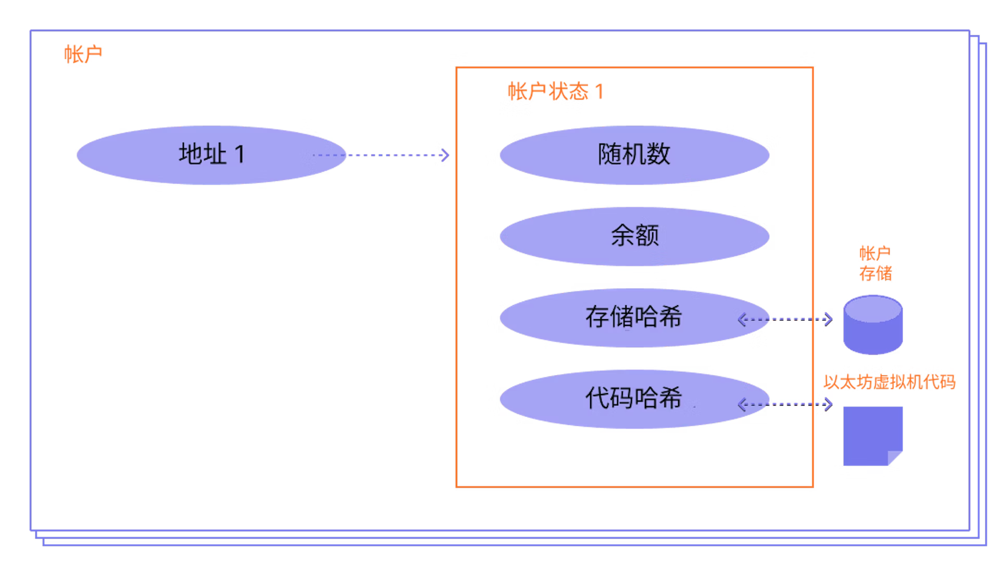

# 以太坊

## 基础主题

### 以太坊简介

* 区块链
  * 公共数据库，由网络中很多计算机节点更新和共享
  * 区块：将数据和状态按照顺序批量，即打包成块存储；
  * 链：每个区块加密引用其父块，类似链表；
  * 区块链不允许篡改，想要改变必须依赖整个网络的共识；
* 共识
  * 以太坊采用权益证明共识机制，之前是工作量证明共识机制，因为太浪费资源，所以改成了权益证明；
* Block
  * 由BlockNumber(区块号)、Nonce(随机数)、Data(数据部分)以及Prev(指向前一个节点的Hash值)组成；
  * 每个区块有独一无二的hash值；
  * 每个区块记录父节点的Hash值；
  * Hash => Block => BlockChain => Distributed => Tokens => Coinbase
* 以太坊
  * 是一条区块链
  * 有一台**以太坊虚拟机(EVM)**,其状态得到以太坊网络中所有人的一致同意；
  * 所有参与节点(计算机)都能请求EVM进行计算请求(需要支付gas)；
  * 执行请求会改变虚拟机EVM状态变化，从而在整个网络中传播；
  * 计算请求被称为交易请求，所有交易记录以及以太坊虚拟机的当前装备又存储到区块链中；
* 以太币(eth)
  * 以太坊上的原生加密货币
  * 目的：允许计算市场化
  * 市场为参与者提供经济激励，验证并执行交易请求，提供计算资源；
  * 按照计算资源来付费，阻止恶意参与者执行无穷计算或其他计算密集型应用；
  * 以太币还用于通过以下三种主要方式为网络提供加密经济安全性： 
    * 作为一种奖励方式，奖励提议区块或指出其他验证者不诚实行为的验证者；
    * 由验证者抵押，作为遏制不诚实行为的抵押品 — 如果验证者试图行为不端，它们的以太币可能会被销毁
    * 用于对新提议的区块的“投票”进行加权，并影响共识机制的分叉选择部分。
* 智能合约
  * 开发者上传至网络并由网络执行的程序称为智能合约
  * 类比于自动售卖机，或者游戏上线到平台；
  * 上线需要支付以太币；
  * 其他参与者调用智能合约也需要支付以太币；
* 账户
  * 存储以太币的钱包

### 以太币简介

* 加密货币
  * 基于分布式账本(区块链)的交换媒介
  * 交换媒介是指被广泛接受、可支付商品和服务的物品；区别于一般等价物
  * 第一个加密货币是2009年，由Satoshi NakaMoto(中本聪)创建并发行的比特币；
* 以太币(ETH)
  * 用于以太坊的加密货币，是以太坊的原生货币，在主网验证和提出区块需要以太币，即支付Gas费用；
  * 去中心化金融借贷市场的主要抵押形式；
  * 非同质化代币市场的主要记账单位
* 铸造以太币
  * 指在以太坊账本上创造新以太币的过程；底层以太坊协议创造，单一用户不可能创造；
  * 用来奖励提议的每个区块，以及在每个时段的检查点奖励验证者执行的和达成共识有关的其他活动
  * 总发行量取决于验证者的数量和它们质押的以太币数量
  * 总发行量的大约 1/8 会奖励给区块提议者，剩余部分在其它验证者中分配
* 燃烧以太币
  * 除了创建过程，还有销毁过程，当以太币被燃烧掉后，就永远退出流通；
  * 以太坊上的每一笔交易都会发生以太币销毁。 当用户为他们的交易支付费用时，网络根据交易需求设置的基础燃料费会被销毁
  * 销毁基础费抑制区块生产者操纵交易的能力
* 以太币面额
  * Wei 是最小的以太币面额，因此在以太坊黄皮书等众多技术实现中，都以 Wei 为单位进行计算：10^(-18) => 技术实施 
  * Gwei（giga-wei 的缩写），常用于描述以太坊上的燃料费用: 10^(-9) => 可读燃料费用
* 传输以太币
  * 每笔交易包含的Value，单位(Wei)
* 查询以太币
  * 查询账户的Balance字段；单位(Wei)
  * [Etherscan工具](https://etherscan.io/address/0xde0b295669a9fd93d5f28d9ec85e40f4cb697bae)
  * [以太币基金会余额](https://etherscan.io/address/0xde0b295669a9fd93d5f28d9ec85e40f4cb697bae)

### 去中心化应用程序(DApp)

* DAPP
  * 在去中心化网络中构建的应用程序，结合了智能合约和前端用户界面 - 和中心化App类似
  * 定义：一个dapp的后端代码运行在去中心化p2p网络上的；对应的，app是运行在中心化服务器上的；
  * dapp可以是任何编程语言编写的(类比app)；有前端代码和用户界面，能调用后端；前端可以托管在去中心化存储上(IPFS);
    * 去中心化
    * 确定性
    * 图灵完备
    * 隔离性
* 智能合约
  * 大概是dapp的后端
  * 智能合约一旦部署到以太坊网络中，就无法更改，所以合约要非常仔细设计，全面测试
* DApps开发好处
  * 零停机时间 - 整个网络都可以提供服务，攻击者无法对单个Dapp发起DOS攻击；
  * 隐私 - 无需真是的身份来部署与交互
  * 抵制审查 - 无法阻止提交交易、部署或读取数据
  * 数据完整性 - 区块链不可篡改
  * 去信任的计算/可验证的行为
* DApps开发缺陷
  * 维护 - 更难维护和更新，即使发现旧版本的漏洞或安全风险；
  * 巨大的性能开销 - 更难扩展更多性能；每个节点会存储每一笔交易；达成权益证明共识也需要时间；
  * 网络拥塞 - 一个dapp使用了太多计算资源，整个网络都会承担影响；交易速度缓慢，每秒10-15笔；
  * 用户体验 - 不友好
  * 集中化
* Web2.0 VS Web3.0
  * Web2.0 即当前互联网版本
  * Web3.0 指的是在区块链上允许的去中心化应用程序
  * Web3.0优势
    * 无需授权
    * 没有人能拒绝或阻止用户访问服务
    * 付款使用原生代币(以太币)
    * 以太坊是图灵完备的，几乎可以进行任何编程

### 账户
以太坊账户是一个具有以太币余额的实体，可以在以太坊上发送交易。

* 账户类型
  * 外部账户
  * 合约账户 - 部署到网络中的智能合约
* 功能
  * 接收、持有和发送ETH和Token
  * 与已部署的智能合约交互
* 区别
  * 外部持有账户
    * 创建免费
    * 可发起交易
    * 外部账户之间只能进行ETH和代币交易
    * 由公钥和私钥组成
  * 合约
    * 创建合约有成本，使用存储空间
    * 只能在收到交易时发送交易
    * 由外部向合约账户发起的交易能触发可执行多种操作的代码
    * 合约账户没有私钥，由代码逻辑控制
* 理解账户
有四个字段

  * nonce - 一个计数器，用来显示外部帐户发送的交易数量或合约帐户创建的合约数量
  * balance – 这个地址拥有的 Wei 数量
  * codeHash - 该哈希表示以太坊虚拟机 (EVM) 上的帐户代码
  * storageRoot – 有时被称为存储哈希
* 钱包
  * 账户和钱包不同；账户是用户拥有的以太坊账户的密钥对；钱包是界面或应用程序，与以太坊账户交互；

### 交易
交易是由帐户发出，带密码学签名的指令。 帐户将发起交易以更新以太坊网络的状态。 最简单的交易是将 ETH 从一个帐户转到另一个帐户。

* 付费：改变 EVM 状态的交易需要广播到整个网络；
* 交易信息
  * from - 发送者地址(只能是外部账户，合约无法发送交易)
  * to - 接收地址(外部账户或合约)
  * signature - 发送者标识符
  * nonce - 有序递增的计数器，表示来自账户的交易数量
  * value - 转移的以太币数量(Wei)
  * input data - 可选字段
  * gasLimit - 消耗燃料的最大数量
  * maxPriorityFeePerGas - 给验证者的小费
  * maxFeePerGas - 愿意为交易支付的每单位燃料的最高费用
* 燃料：指验证者处理交易所需的计算，用户必须为此计算支付费用；
```json
{
  "from": "0xEA674fdDe714fd979de3EdF0F56AA9716B898ec8",
  "to": "0xac03bb73b6a9e108530aff4df5077c2b3d481e5a",
  "gasLimit": "21000",
  "maxFeePerGas": "300",
  "maxPriorityFeePerGas": "10",
  "nonce": "0",
  "value": "10000000000",
}
```
* 交易类型
  * 常规交易 - 外部账户转账
  * 合约部署交易: 没有to地址，数据字段用于合约代码
  * 执行合约：与已部署的智能合约进行交互的交易，此时to指向智能合约地址
* 燃料
执行交易需要耗费燃料，简单的转账交易需要21000单位的燃料
  * eg：Bob要在baseFeePerGas为190Gwei且maxPriorityFeeGas为10Gwei时给Alice发送一个以太币，Bob要支付的费用：
```shell
(190+10)*21000 = 4,200,000 gwei = 0.0042ETH

此时Bob账户会扣除1.0042 ETH
Alice账户增加1.0 ETH
基础费会燃烧 -0.00399 ETH
验证者获得0.000210 ETH作为小费
```

### 区块
区块是指一批交易的组合，并且包含链中上一个区块的哈希。 这将区块连接在一起（成为一个链），因为哈希是从区块数据中加密得出的。
* 为什么需要区块
  * 为了确保以太坊网络上的所有参与者保持同步状态并就交易的确切历史达成共识，我们将交易分为多个区块。 这意味着同时有数十个（甚至数百个）交易被提交、达成一致并同步。
* 权益证明协议
  * 验证节点必须向存款合约中质押 32 个以太币，作为抵押品防止发生不良行为。
  * 在每个时隙（12 秒的时间间隔）中，会随机选择一个验证者作为区块提议者。他会打包交易数据，确定新的状态，然后将信息包装到一个区块中并传送给其他验证者；
  * 其他获悉新区块的验证者再次执行区块中包含的交易，确定他们同意对全局状态提出的修改。如果有效会被添加到自己的数据库中；
  * 如果验证者获悉在同一时隙内有两个冲突区块，他们会使用自己的分叉选择算法选择获得最多质押以太币支持的那一个区块。
* 区块时间
  * 区块时间是指两个区块之间的时间间隔。 在以太坊中，时间划分为每 12 秒一个单位，称为“时隙”。
  * 区块时隙可能为空，因为验证者可能偶尔不在线；
* 区块大小
  * 每个区块目标大小为1500万单位燃料，最大为2被目标(即3000万单位燃料)；
  * **区块中所有交易消耗总燃料量必须低于区块的燃料限制**。确保区块不能任意扩大，节点处理能力不大时也可以跟上。


## 参考资料

* [以太坊白皮书](https://ethereum.org/zh/whitepaper/)
* [以太坊黄皮书](https://ethereum.github.io/yellowpaper/paper.pdf)
* [anders的区块链](https://github.com/anders94/blockchain-demo)
* [以太币面额计算器](https://www.alchemy.com/gwei-calculator)
* 去中心化存储[IPFS](https://ipfs.tech/)
* IPFS on [Github](https://github.com/ipfs)
* [An IPFS Implementation in GO](https://github.com/ipfs/kubo) 
* [Web3.0应用架构](https://www.preethikasireddy.com/post/the-architecture-of-a-web-3-0-application)
* [uniswap](https://app.uniswap.org/)
* [去中心化应用探索](https://ethereum.org/zh/dapps/#beginner)
